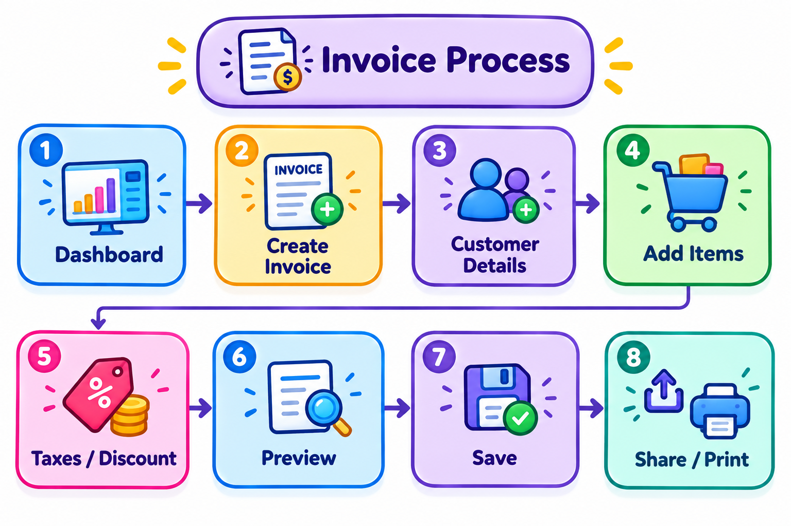
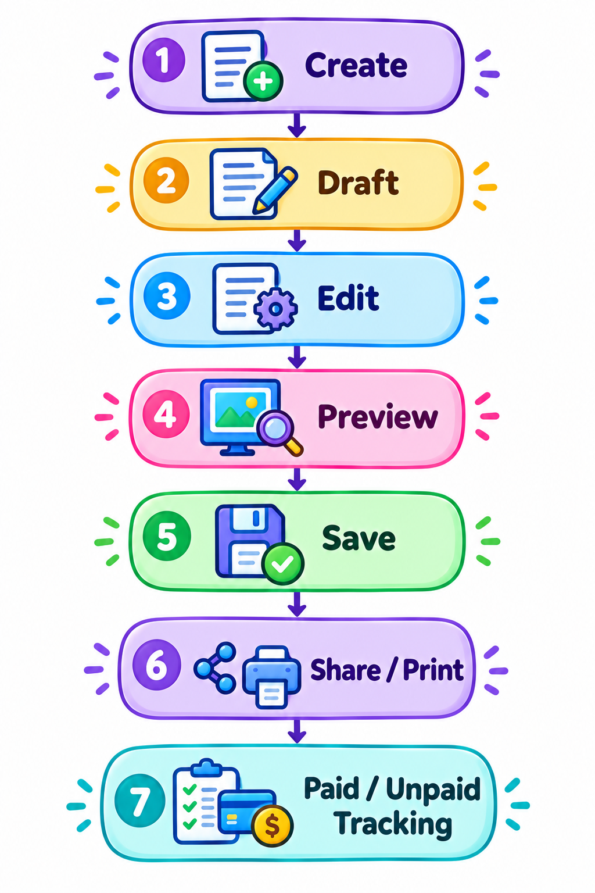
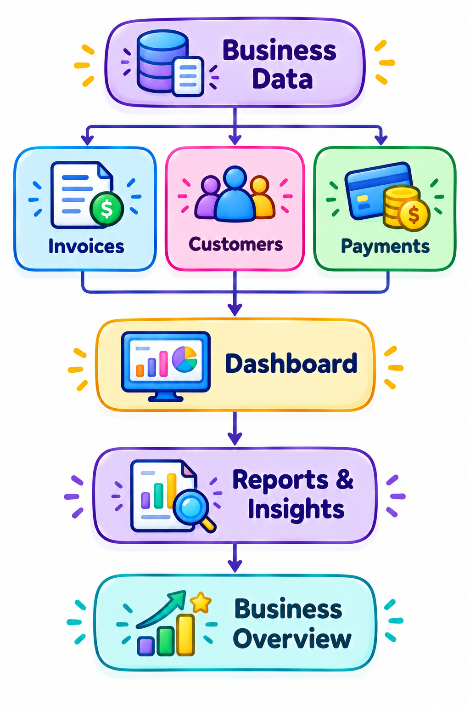
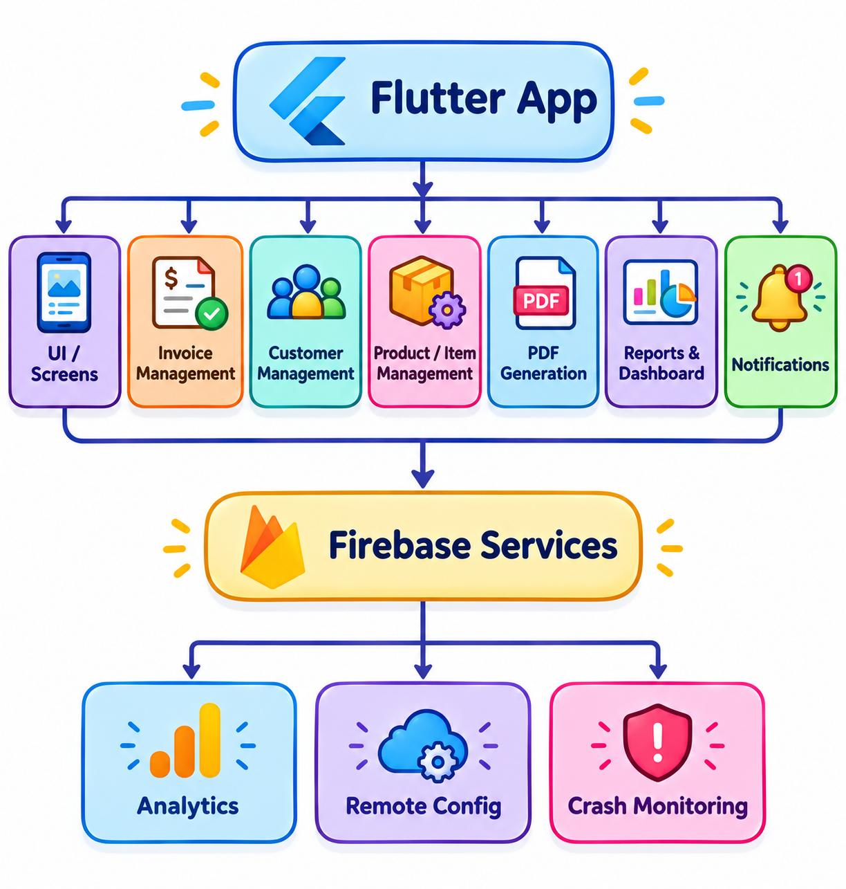

# Invoice Maker

### Professional Flutter Invoice & Business Management Application

A production Flutter mobile application designed to help businesses create, customize, manage, track, and share professional invoices, estimates, receipts, and payment records.

> **Portfolio Case Study**
> This repository presents my contributions and technical experience on a production application. Proprietary source code and confidential company materials are not included.

---

# Project Overview

Invoice Maker is a business-focused mobile application built to simplify everyday invoicing and document management.

The application allows businesses to manage clients and items, create professional invoices, track payment statuses, generate receipts and estimates, customize invoice templates, view business insights, and share or print invoice documents.

I contributed to the application across **Flutter development, UI/UX implementation, invoice workflows, dashboard and reporting features, PDF generation, Firebase services, notifications, subscriptions, performance, and production development**.

---

# Project Facts

| Area                     | Details                       |
| ------------------------ | ----------------------------- |
| **Role**                 | Flutter Developer             |
| **Platform**             | Android & iOS                 |
| **Framework**            | Flutter                       |
| **Language**             | Dart                          |
| **Backend / Services**   | Firebase                      |
| **Analytics**            | Firebase Analytics            |
| **Remote Configuration** | Firebase Remote Config        |
| **Crash Monitoring**     | Firebase Crashlytics          |
| **Monetization**         | Google Ads, Subscriptions     |
| **Design**               | Figma                         |
| **Project Type**         | Production Mobile Application |

---

# Product Goal

The primary goal of Invoice Maker is to make professional invoicing accessible from a mobile device while reducing the complexity of managing business documents and payment records.

The product brings together:

* Business information
* Client management
* Product and item management
* Invoice creation
* Estimates
* Receipts
* Payment tracking
* Invoice customization
* PDF generation
* Printing and sharing
* Dashboard insights
* Reports
* Notifications
* Subscription-based features

---

# My Role

## Flutter Development

* Developed and improved production Flutter features
* Implemented application workflows and interactive functionality
* Built business-focused mobile interfaces
* Worked on invoice creation and management
* Implemented and improved application flows
* Supported production releases and continuous improvements

## Invoice & Business Workflows

* Implemented invoice creation workflows
* Worked on business information management
* Worked on client management
* Worked on product and item management
* Implemented payment status tracking
* Worked with paid, unpaid, overdue, and partially paid invoices
* Worked on partial payment tracking
* Implemented estimates and receipts
* Worked on invoice signatures
* Worked on invoice previews and templates

## Dashboard & Reporting

* Worked on dashboard visualizations
* Implemented invoice and payment insights
* Worked with charts and graphs
* Worked on reports and summaries
* Implemented date-based reporting experiences
* Improved business data visualization

## PDF, Printing & Sharing

* Worked on invoice document generation
* Implemented PDF-related workflows
* Worked on invoice previews
* Worked on printing workflows
* Worked on invoice sharing
* Worked on converting paid invoices into receipts

## Firebase & Production Services

* Firebase Analytics
* Firebase Remote Config
* Firebase Crashlytics
* Production monitoring
* Crash investigation
* Remote configuration
* Product behavior analysis

## UI/UX

* Implemented custom Flutter UI
* Translated Figma designs into Flutter
* Built responsive layouts
* Created interactive components
* Worked on invoice creation interfaces
* Worked on invoice preview interfaces
* Implemented dashboard visualizations
* Worked on charts and graphs
* Improved navigation and usability

## Monetization & Subscriptions

* Worked on subscription-related features
* Implemented subscription-based workflows
* Worked with advertising and monetization features
* Supported premium product experiences

---

# Key Features

## Invoice Management

The application provides a complete workflow for creating and managing business invoices.

* Create professional invoices
* Add business information
* Add and manage clients
* Add products and items
* Set invoice dates
* Set due dates
* Track payment status
* Paid invoices
* Unpaid invoices
* Overdue invoices
* Partially paid invoices
* Partial payment tracking
* Invoice signatures
* Invoice receipts
* Invoice estimates

---

# Invoice Customization

Businesses can create professional documents while maintaining their own branding and visual identity.

* Multiple invoice templates
* Invoice previews
* Custom invoice layouts
* Business logo and branding
* Customizable invoice information
* Professional document designs

---

# Invoice Workflow

The core invoice workflow connects business information, client data, items, document generation, and payment tracking.

### Core Journey

**Business Setup → Client → Items → Create Invoice → Customize → Preview → Save → Share / Print → Payment Tracking**

The workflow is designed to move users from invoice creation to a complete business document and payment record.

---

# Invoice Lifecycle

Invoices can move through different stages depending on their payment state and business activity.

### Supported Payment States

* Unpaid
* Partially Paid
* Paid
* Overdue

This allows businesses to keep track of outstanding payments and understand the current state of each invoice.

---

# Dashboard & Business Insights

The dashboard provides a visual overview of invoice and payment activity.

## Dashboard Features

* Invoice amount overview
* Paid amount tracking
* Payment insights
* Date-based analytics
* Weekly invoice insights
* Pie charts
* Graphs
* Reports
* Invoice summaries
* Payment summaries

The dashboard turns invoice activity into visual information that can help users understand their business performance.

---

# Application Architecture

The application combines Flutter-based mobile interfaces with business workflows, document generation, Firebase services, analytics, notifications, and monetization components.

## Main Functional Areas

* Flutter application
* UI / UX
* Business management
* Client management
* Product and item management
* Invoice management
* Payment tracking
* PDF and document workflows
* Dashboard and reports
* Notifications
* Firebase services
* Analytics
* Crash monitoring
* Subscriptions
* Monetization

The architecture diagram presents the major application areas without exposing proprietary implementation details.

---

# PDF, Printing & Sharing

Professional invoice documents are an important part of the application experience.

The application supports workflows for:

* Invoice document generation
* PDF creation
* Invoice preview
* Printing invoices
* Sharing invoices
* Digital document workflows
* Converting paid invoices into receipts

The goal is to allow users to move from creating an invoice to delivering a professional document without leaving the application workflow.

---

# Notifications

Notifications help users stay informed about important invoice and payment activity.

Supported notification-related experiences include:

* Invoice updates
* Payment updates
* Due-date related updates
* Invoice status notifications
* User activity notifications

These experiences help connect invoice management with ongoing business activity.

---

# UI/UX & Design

The application focuses on providing a simple and professional experience for business users.

## Design Focus

* Business-focused interfaces
* Clear information hierarchy
* Simple navigation
* Responsive layouts
* Interactive components
* Professional invoice previews
* Custom templates
* Dashboard visualizations
* Charts and graphs
* Clear payment status indicators
* Figma-based design implementation

## Design Workflow

**Figma → Flutter UI → Interactive Components → Testing → Refinement → Production**

My focus was not only on implementing screens but also on maintaining consistency between the intended design and the final interactive product.

---

# Screenshots

## Dashboard

The dashboard provides a high-level view of invoice activity, payments, and business insights.

---

## Filters

Filtering helps users navigate invoice and business information more efficiently.

---

## Invoice Creation

The invoice creation interface allows users to build professional business documents using their saved business, client, and item information.

---

## Invoice Preview

The preview experience allows users to review the final invoice before sharing or printing.

---

## Invoice Templates

Multiple templates provide different professional layouts for business documents.

---

## Reports

Reports provide visual insights into invoice and payment activity.

---

## Notifications

Notification experiences keep users informed about relevant invoice and payment activity.

---

# Performance & Engineering

Performance, stability, and production reliability were important parts of the development process.

## Areas I Worked On

* Identifying performance issues
* Optimizing application workflows
* Improving user interactions
* Investigating application crashes
* Working on ANR-related issues
* Improving application stability
* Monitoring production behavior
* Using analytics and crash monitoring to identify issues
* Improving production reliability

Production applications require continuous monitoring because issues can appear under real-world usage that may not always be visible during development.

---

# Engineering Challenges & Solutions

## 1. Managing Complex Invoice Workflows

### Challenge

Invoice applications involve multiple related entities and states, including businesses, clients, items, invoices, payments, estimates, and receipts.

### Approach

Worked on structured application flows that allow users to move between business data, invoice creation, document preview, and payment tracking.

### Outcome

Created a connected workflow from invoice creation through document delivery and payment management.

---

## 2. Payment State Management

### Challenge

Invoices can have different payment states, including unpaid, partially paid, paid, and overdue.

### Approach

Worked on payment status and partial payment workflows so invoice information could reflect the current payment state.

### Outcome

Provided users with clearer visibility into outstanding and completed payments.

---

## 3. Professional Document Generation

### Challenge

An invoice needs to remain visually consistent when it moves from an interactive mobile interface to a professional document.

### Approach

Worked on invoice preview, PDF, printing, and sharing workflows while maintaining the intended document layout.

### Outcome

Created a workflow that connects invoice editing with professional document delivery.

---

## 4. Business Data Visualization

### Challenge

Invoice and payment data can become difficult to understand when presented only as lists.

### Approach

Worked on dashboard charts, graphs, reports, and summaries to provide a more visual representation of business activity.

### Outcome

Improved the ability to understand invoice and payment activity through visual insights.

---

## 5. Production Stability

### Challenge

Production applications can experience crashes, ANRs, and performance issues that may not always be reproducible during development.

### Approach

Used production monitoring, analytics, and crash diagnostics to investigate issues and identify areas requiring improvement.

### Outcome

Supported targeted stability and performance improvements across the application.

---

# Firebase Integration

Firebase services supported analytics, remote configuration, crash monitoring, and production application management.

## Firebase Services

| Service                    | Purpose                                               |
| -------------------------- | ----------------------------------------------------- |
| **Firebase Analytics**     | Product and user behavior analytics                   |
| **Firebase Remote Config** | Remote configuration and supported feature management |
| **Firebase Crashlytics**   | Crash monitoring and stability investigation          |

These services helped support continuous monitoring and improvement of the production application.

---

# Product & Business Focus

Working on Invoice Maker provided experience beyond mobile application development.

The application is built around real business workflows such as:

* Business management
* Client management
* Product management
* Invoice creation
* Payment tracking
* Document management
* Reporting
* Notifications
* Subscription-based features
* User engagement
* Product usability

This required thinking about both the technical implementation and the business workflow behind each feature.

---

# Monetization & Subscriptions

The application includes subscription-based product features and monetization workflows.

## Subscription Experience

* Subscription-related features
* Premium product experiences
* Monetization workflows
* Feature-based subscription access

The monetization experience is designed to work alongside the core invoicing workflow while keeping the primary business tasks accessible and understandable.

---

# Production Development

Working on a production application required continuous iteration rather than one-time development.

### Development Workflow

**Requirement → UI/UX → Flutter Development → Testing → Debugging → Performance Review → Production Release → Monitoring → Improvements**

My production responsibilities included:

* Feature development
* UI/UX improvements
* Invoice workflow development
* Bug fixing
* Performance optimization
* Crash investigation
* ANR investigation
* Analytics monitoring
* Remote configuration
* Notification workflows
* Subscription features
* Dashboard improvements
* Reporting improvements
* Production release support
* Continuous application improvements

---

# Technical Stack

## Mobile Development

* Flutter
* Dart

## Firebase

* Firebase Analytics
* Firebase Remote Config
* Firebase Crashlytics

## Monetization

* Google Ads
* Subscriptions

## Design

* Figma
* Custom UI/UX
* Responsive layouts
* Interactive components

## Document & Business Workflows

* Invoice generation
* PDF workflows
* Printing
* Sharing
* Invoice templates
* Receipts
* Estimates
* Payment tracking
* Business reporting

---

# Skills Demonstrated

## Mobile Development

* Flutter
* Dart
* Responsive UI
* Interactive components
* Production application development

## UI/UX

* Figma
* Custom UI implementation
* Business-focused interface design
* Visual hierarchy
* Dashboard design
* Data visualization

## Engineering

* Performance optimization
* Debugging
* Crash investigation
* ANR investigation
* Production monitoring
* Technical problem-solving

## Firebase

* Firebase Analytics
* Firebase Remote Config
* Firebase Crashlytics

## Product Development

* Invoice workflows
* Payment tracking
* Document management
* Dashboard and reporting
* Notifications
* Subscription-based features
* Business-focused product development

---

# Project Highlights

* Contributed to a production Flutter invoice application
* Developed and improved invoice creation workflows
* Worked on business, client, and item management
* Implemented payment status and partial payment workflows
* Worked with paid, unpaid, overdue, and partially paid invoices
* Worked on estimates and invoice receipts
* Implemented customizable invoice templates
* Worked on invoice previews
* Worked on PDF, printing, and sharing workflows
* Developed dashboard visualizations and reports
* Worked with charts and graphs
* Implemented invoice and payment notification experiences
* Integrated Firebase services
* Worked with Firebase Analytics and Remote Config
* Worked with Firebase Crashlytics
* Worked on subscription-based features
* Investigated performance and ANR-related issues
* Supported production releases and continuous improvements

---

# Product Thinking

This project strengthened my understanding of how technical implementation connects with real business requirements.

Important product considerations included:

* How quickly users can create an invoice
* How business information is organized
* How clients and items are managed
* How payment states are communicated
* How users review documents before sharing
* How reports help users understand business activity
* How notifications support ongoing workflows
* How monetization can coexist with core business functionality
* How application performance affects productivity

This experience helped connect **Flutter development, UI/UX, business workflows, and product thinking** within a production application.

---

# What I Learned

## Technical

* Building and maintaining production Flutter applications
* Developing complex business workflows
* Working with document-generation experiences
* Working with Firebase production services
* Monitoring application behavior
* Investigating crashes and ANR-related issues
* Improving application performance and stability

## Product

* Understanding business-focused mobile applications
* Designing workflows around real-world invoicing requirements
* Working with payment states
* Building reporting and dashboard experiences
* Connecting technical implementation with product requirements

## Design

* Translating Figma designs into Flutter
* Designing business-focused interfaces
* Creating professional document previews
* Building dashboards and visualizations
* Maintaining consistent UI/UX across complex workflows

---

# Project Context

This project was developed as part of a professional product team.

My contribution focused on:

**Flutter Development → UI/UX → Invoice Workflows → Business Management → Payment Tracking → Dashboard & Reports → PDF & Sharing → Firebase → Notifications → Subscriptions → Performance → Production Improvements**

This repository is intentionally structured as a **portfolio case study** rather than a source-code repository.

---

# Source Code & Confidentiality

The original production source code is not included in this repository.

This is intentional because the application was developed as part of a professional product environment.

The repository does not contain:

* Proprietary source code
* Private company assets
* Credentials
* API keys
* Internal configuration
* Client information
* Confidential business information
* Private backend implementation

The purpose of this repository is to document my **technical contribution, problem-solving approach, product understanding, and production experience**.

---

# Disclaimer

This repository is a **portfolio case study** and does not contain the application's source code.

The original application was developed as part of a professional product team. Proprietary source code, private assets, credentials, client information, internal company materials, and other confidential information are intentionally excluded from this repository.

The screenshots, diagrams, and descriptions included here are presented for portfolio and professional documentation purposes.

---

# About Me

I am a **Flutter Developer with 5+ years of hands-on experience in mobile application development**, with a strong focus on custom UI/UX, interactive experiences, performance, and production applications.

I am currently expanding my skills toward **backend development, Node.js, and AI**, while pursuing a **BS in Business & Information Technology (BBIT) at Virtual University of Pakistan**.

My interests include:

* Mobile Development
* Flutter
* Backend Development
* AI
* UI/UX
* Product Development
* Business & Technology

---

# Career Interests

I am interested in opportunities involving:

* Flutter / Mobile Development
* Backend Engineering
* Full-Stack Development
* AI-powered Applications
* UI/UX-focused Product Development
* Software Engineering
* Product Development
* Business & Technology

---

# Connect With Me

---

# Portfolio

More projects and case studies are available on my GitHub profile:

**GitHub:**
https://github.com/bismanaz12

---

### Built for business.

### Designed for simplicity.

### Developed with Flutter.

