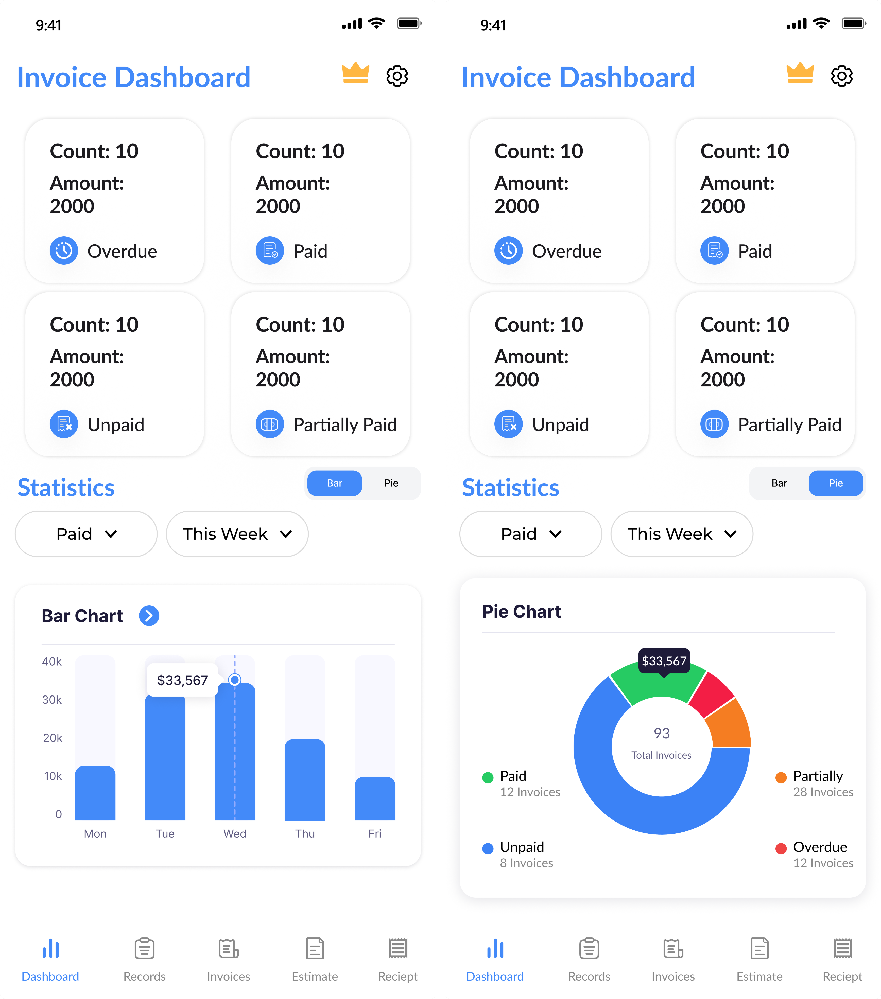
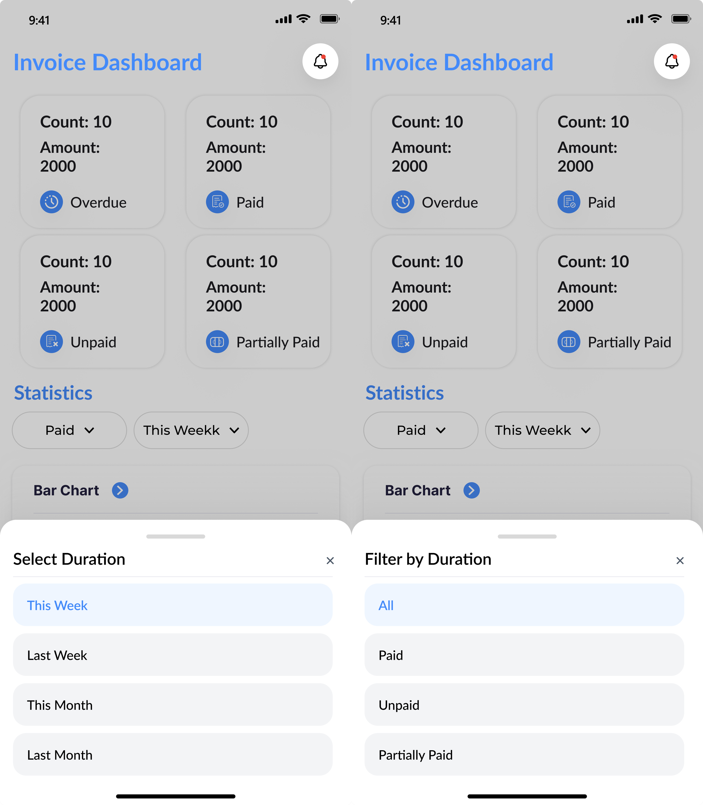
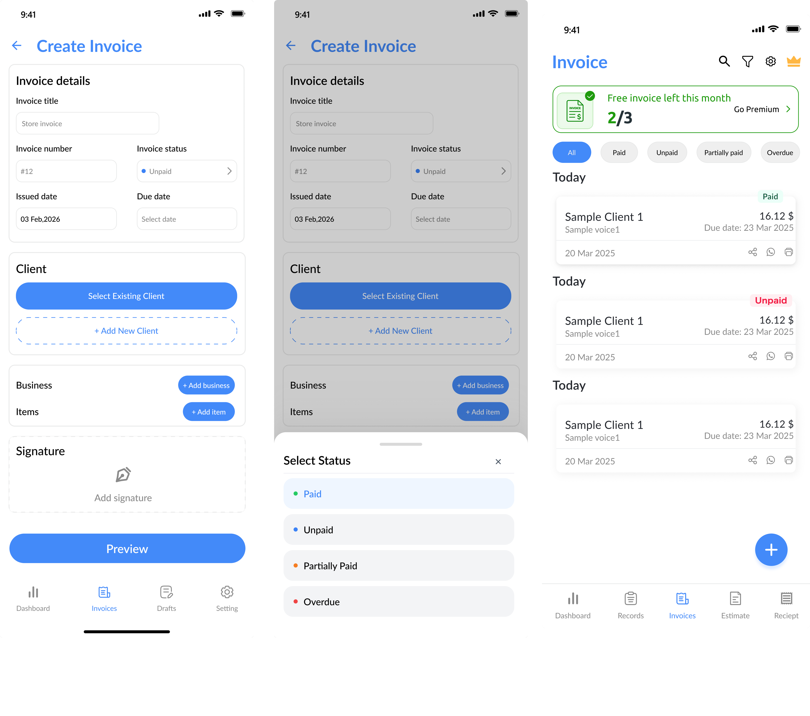
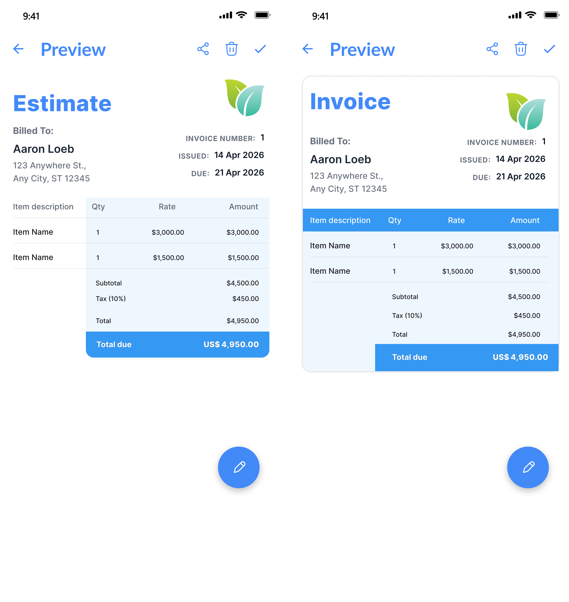
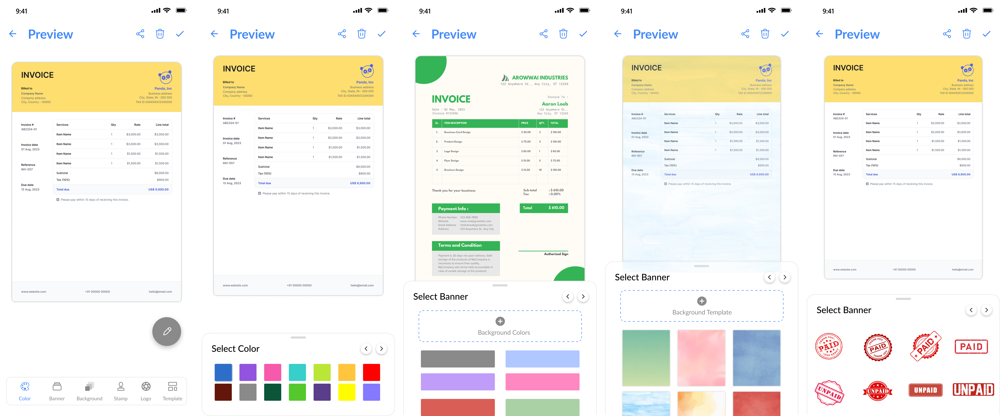
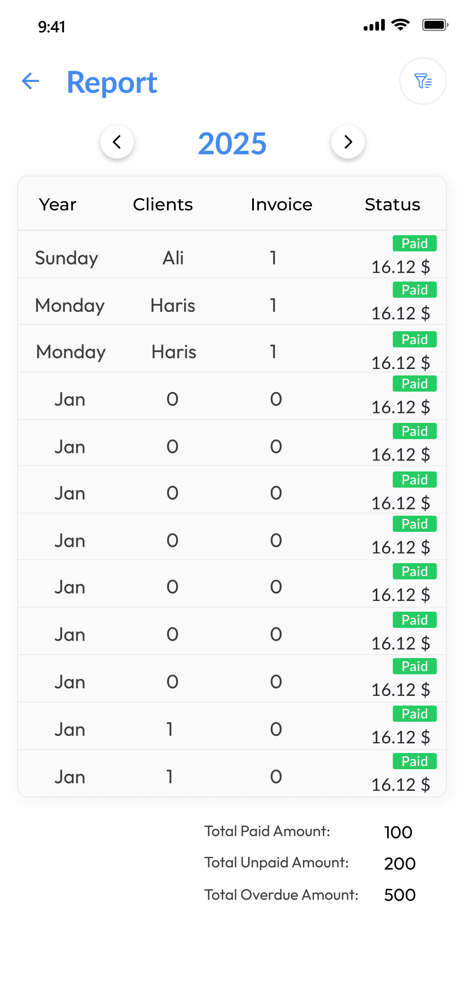
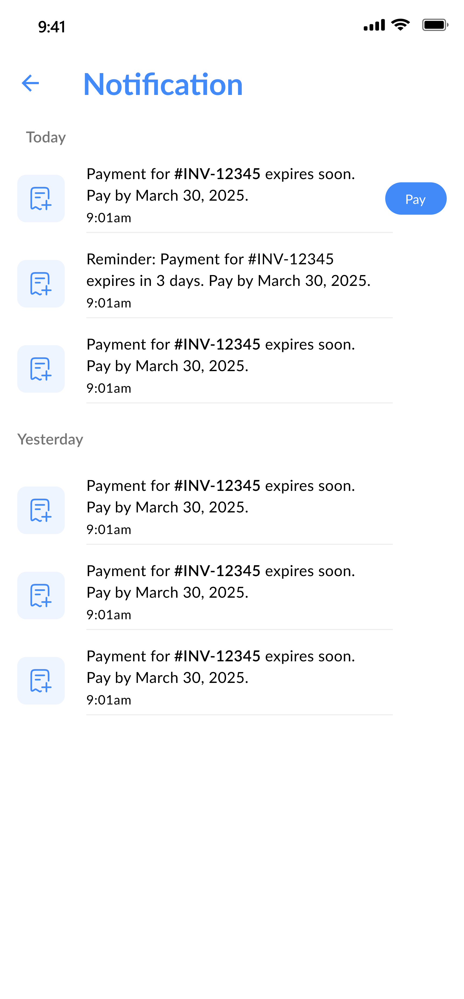

# Invoice Maker

A production Flutter application designed to help businesses create, customize, manage, and share professional invoices, estimates, and receipts.

> Professional project developed as part of a product team.

---

## Overview

Invoice Maker is a business-focused mobile application that simplifies invoice creation, payment tracking, document management, and business reporting.

I contributed to the development and improvement of the application across Flutter development, custom UI/UX, invoice workflows, dashboard and reporting features, Firebase services, notifications, subscriptions, performance, and production app development.

The application provides businesses with tools to manage clients, items, invoices, estimates, payments, receipts, and branded invoice documents from a mobile device.

---

## My Role

**Flutter Developer**

My contributions included:

- Developing and improving Flutter application features
- Building custom UI/UX and interactive interfaces
- Implementing invoice creation and management workflows
- Working on business, client, and item management
- Implementing invoice payment status tracking
- Working with paid, unpaid, overdue, and partially paid invoices
- Implementing invoice estimates and receipts
- Working on invoice previews and templates
- Implementing invoice customization and business branding
- Working on dashboard charts, graphs, and reporting
- Implementing PDF generation, printing, and sharing workflows
- Working on payment and invoice notifications
- Integrating Firebase services
- Working with Firebase Analytics and Remote Config
- Implementing subscription-related features
- Working on application performance and stability
- Supporting production application development and releases

---

## Key Features

### Invoice Management

- Create and manage professional invoices
- Add businesses and business information
- Add and manage clients
- Add products and items
- Invoice dates and due dates
- Payment status tracking
- Paid invoices
- Unpaid invoices
- Overdue invoices
- Partially paid invoices
- Partial payment tracking
- Invoice signatures
- Invoice receipts
- Invoice estimates

### Invoice Customization

- Invoice previews
- Multiple invoice templates
- Custom invoice layouts
- Business logo and branding
- Customizable invoice information
- Professional document designs

### Dashboard & Reports

The dashboard provides an overview of invoice and payment activity through visual data.

- Invoice amount overview
- Paid amount tracking
- Payment insights
- Date-based analytics
- Weekly invoice insights
- Pie charts
- Graphs
- Reports
- Invoice and payment summaries

### PDF, Printing & Sharing

- Generate invoice documents
- PDF support
- Print invoices
- Share invoices
- Invoice preview
- Convert paid invoices into receipts
- Digital document workflows

### Notifications

The application keeps users informed about important invoice and payment activity.

- Invoice updates
- Payment updates
- Due-date related updates
- Invoice status notifications
- User activity notifications

### Subscriptions & Monetization

- Subscription system
- Subscription-based features
- Monetization workflows

---

## Technologies

| Technology | Usage |
|---|---|
| Flutter | Mobile application development |
| Dart | Application programming |
| Firebase | Application services and infrastructure |
| Firebase Analytics | User behavior and product analytics |
| Firebase Remote Config | Remote configuration and feature management |
| Firebase Crashlytics | Crash monitoring and stability |
| Google Ads | Advertising and monetization |
| Figma | UI/UX design and prototyping |

---

## Performance & Engineering

Performance, stability, and production reliability were important parts of the development process.

I worked on:

- Identifying and improving performance issues
- Optimizing application workflows
- Investigating application crashes
- Working on ANR-related issues
- Improving application stability
- Optimizing user interactions
- Monitoring production behavior
- Using analytics and crash monitoring to identify issues
- Improving production application reliability

---

## UI/UX & Design

The application was designed to provide businesses with a simple and professional way to manage their invoicing workflow.

My work included:

- Custom Flutter UI
- Business-focused interfaces
- Responsive layouts
- Interactive components
- Invoice creation interfaces
- Invoice preview interfaces
- Custom templates
- Dashboard visualizations
- Charts and graphs
- User-friendly navigation
- Figma-based design implementation

---

## Product & Business Focus

Invoice Maker provided experience beyond mobile development by working on a product designed around real business workflows.

The application focuses on:

- Business management
- Client management
- Invoice workflows
- Payment tracking
- Document management
- Business reporting
- Subscription-based features
- User engagement
- Product usability

---

## Screenshots

### Dashboard

### Filters

### Invoice

### Invoice Preview

### Templates

### Reports

### Notifications

---

## App Demo

A short walkthrough showcasing the application's invoice workflow, interface, customization features, and overall user experience.

---

## Technical Focus

This project allowed me to work across multiple areas of production mobile development:

**Flutter Development → Custom UI/UX → Invoice Workflows → Dashboard & Reports → PDF & Sharing → Firebase → Analytics → Notifications → Subscriptions → Performance → Production Releases**

---

## Project Highlights

- Developed and improved production Flutter features
- Worked on complete invoice creation workflows
- Implemented client, business, and item management
- Worked on payment status and partial payment workflows
- Implemented estimates and invoice receipts
- Worked on customizable invoice templates
- Developed dashboard visualizations and reports
- Worked on PDF, printing, and sharing workflows
- Implemented invoice and payment notifications
- Integrated Firebase services and analytics
- Worked on subscription-based features
- Contributed to application performance and stability
- Supported continuous production improvements

---

## Disclaimer

This repository is a **portfolio case study** and does not contain the application's source code.

The original application was developed as part of a professional product team. Proprietary source code, private assets, credentials, client information, and confidential company materials are not included in this repository.

---

## About Me

I am a Flutter Developer with 5+ years of hands-on experience in mobile application development, currently expanding my skills toward **backend development, Node.js, and AI**.

I am also pursuing a **BS in Business & Information Technology (BBIT) at Virtual University of Pakistan**, developing my knowledge across both technology and business.

---

## Connect With Me

- [LinkedIn](https://www.linkedin.com/in/bisma-dev/)
- [Email](mailto:bismanaz674@gmail.com)
